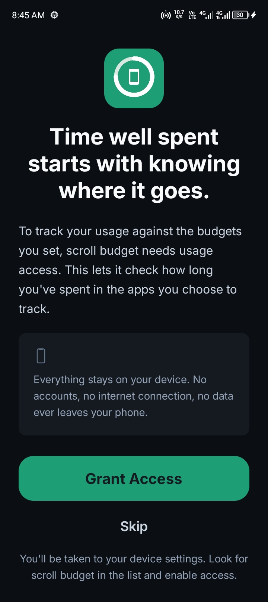
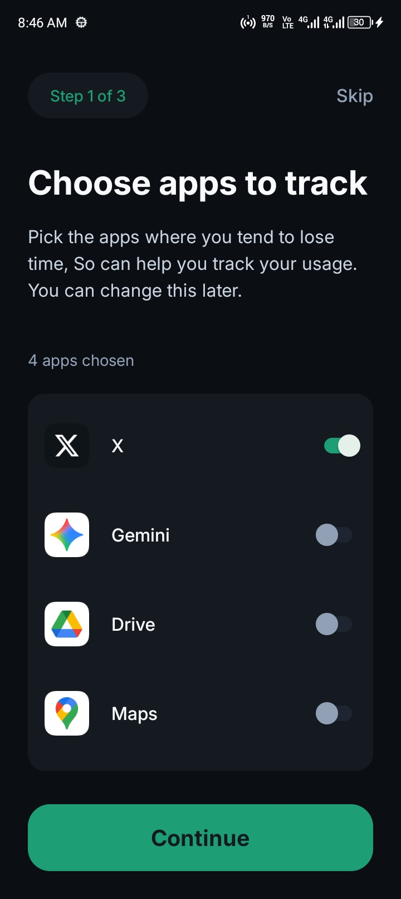
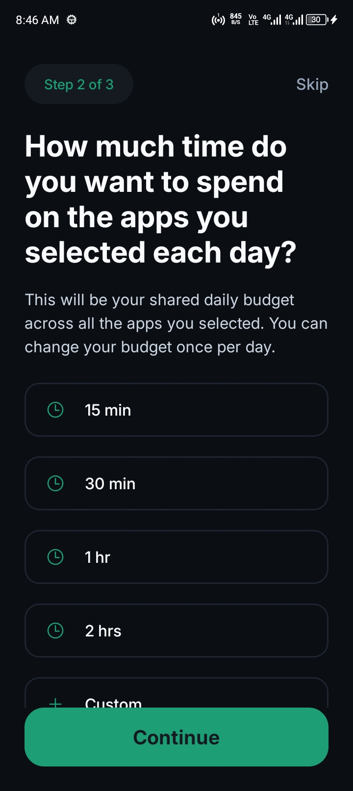
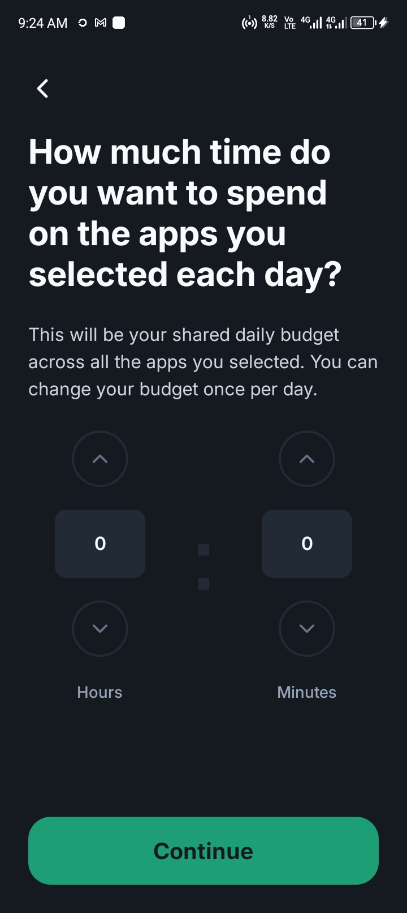
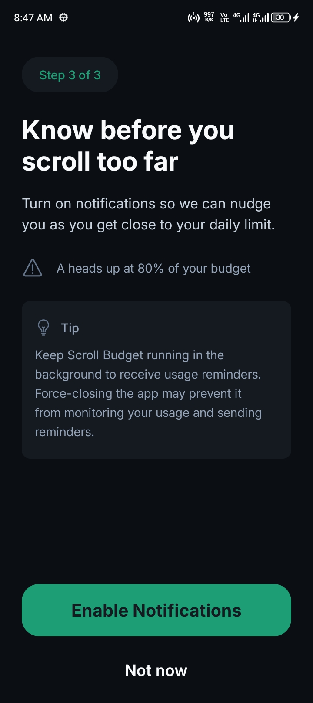
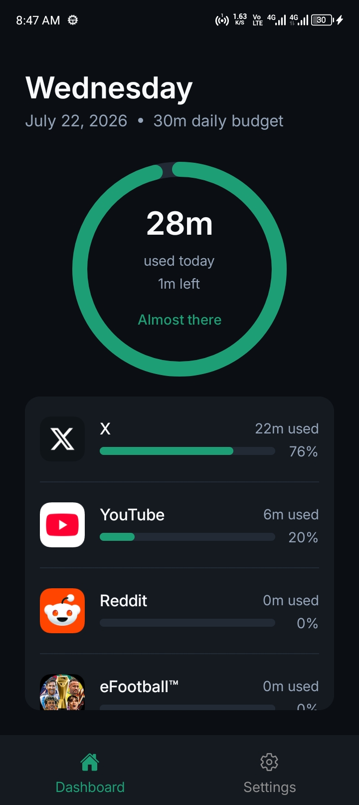

# Scroll Budget

Scroll Budget is a mobile app that helps users set time budgets for specific apps and tracks their real usage against their budget.

Users pick which installed apps they want to limit, set an hourly budget for each, and get notified when they're approaching or hitting their limit. Everything runs and stores data fully on-device.

---

## Tech Stack

- **Framework:** React Native + Expo (Expo Router)
- **Language:** TypeScript
- **Charts:** react-native-gifted-charts
- **Animation:** react-native-svg + react-native-reanimated
- **Usage tracking:** Android Usage Stats API via `@sahil_sensei/react-native-app-usage`
- **Background execution:** `expo-background-task`
- **Notifications:** `expo-notifications`
- **Storage:** `@react-native-async-storage/async-storage`

---

## Features

- **Custom budgets** — Users specify how many hours they want to spend on each selected app.
- **Installed app detection** — Reads the list of apps installed on the device and lets users choose which ones to track.
- **Real usage tracking** — Pulls actual usage data via Android's Usage Stats API and displays it on a dashboard against the user's budget.
- **Background monitoring** — A scheduled background task periodically checks usage against budget thresholds.
- **Local notifications** — Alerts the user via on-device notifications when they approach or exceed their budget.

## Screenshots

### Notification Request

### Select Apps

### Set Scroll Budget

### Notification

### Dashboard

### Update Budget

---

## Platform Support

**Android only, by design.** Android exposes the Usage Stats API (`UsageStatsManager`), which this app uses to read per-app usage. This requires an explicit permission grant from the user in system settings, requested in-app.

iOS does not expose equivalent usage data to third-party apps. Apple's Screen Time / DeviceActivity framework is entitlement-gated and does not provide the kind of per-app usage figures this app relies on, so an iOS version isn't currently feasible without a fundamentally different approach.

## Known Limitations

- **Background check interval is capped at ~15 minutes.** Android's WorkManager (which `expo-background-task` runs on) does not guarantee periodic background execution more frequently than ~15 minutes, regardless of how the task is configured. Real-time, minute-by-minute tracking isn't possible for background checks on Android; the dashboard itself still reflects live usage data whenever the app is open.
- **Background execution reliability varies by device.** Aggressive battery optimization can delay or skip scheduled checks. .
- **Not available on iOS**, for the API access reasons above.

## Try It Out

A signed production APK is available for direct install — no build setup required.

📱 **[Download APK](#)** <!-- TODO: add release link, e.g. GitHub Releases or a direct download URL -->

Since this app uses native modules (usage stats, background tasks), it won't run in Expo Go — the APK is the fastest way to test it on a real device.

## Permissions

On first launch, the app requests:

- **Usage Access** (`PACKAGE_USAGE_STATS`) — granted manually via system settings, prompted in-app with instructions
- **Notifications** — standard runtime permission for local alerts

No account, sign-in, or network permission is required — the app works entirely offline.

## Architecture Notes

- All user data (selected apps, budgets, usage history) is stored locally on-device.
- The background task runs independently of the UI, checking accumulated usage against saved thresholds and firing local notifications when limits are crossed.

## License

All Rights Reserved.
