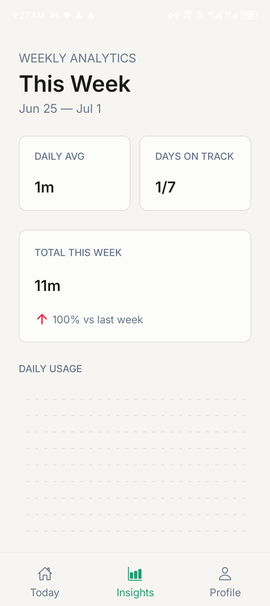
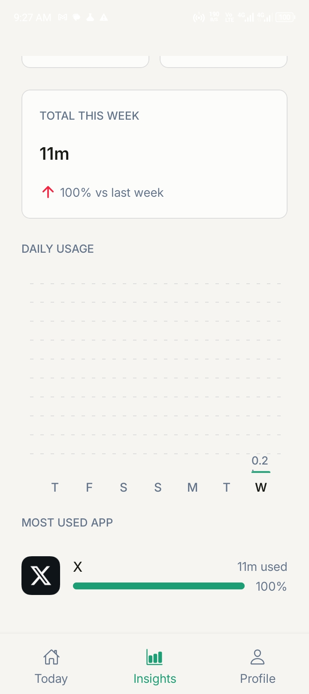
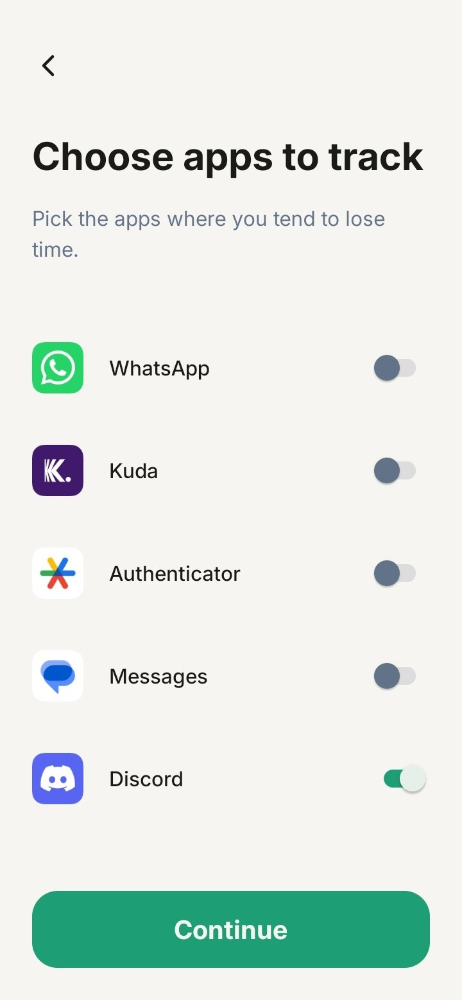
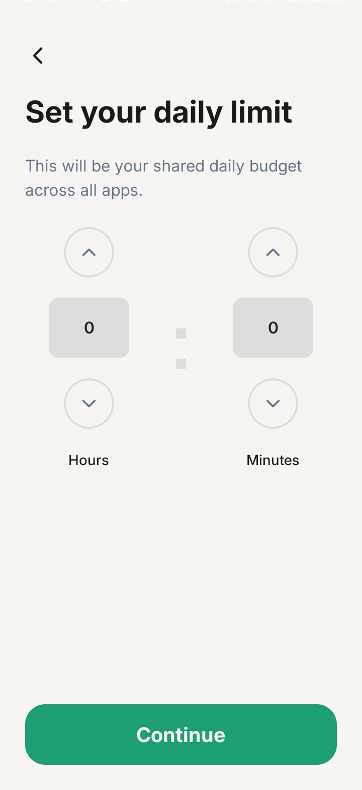
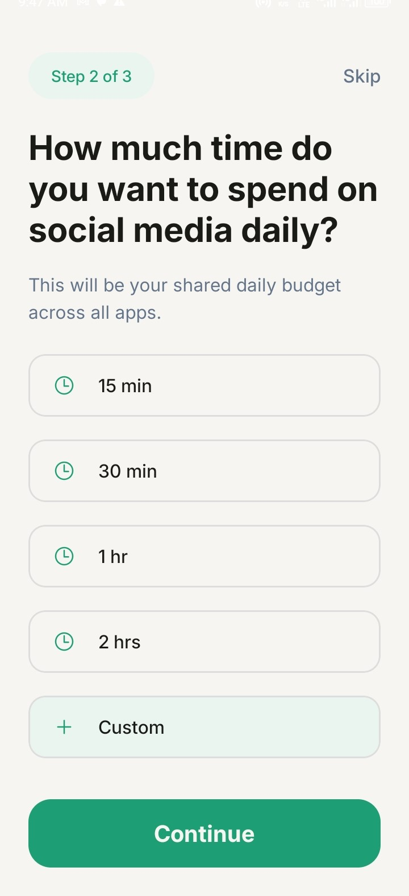

# Scroll Budget

Scroll Budget is a React Native application that helps users build healthier screen-time habits by setting a daily scroll budget for their favorite apps. Instead of asking users to delete apps, Scroll Budget encourages mindful usage through tracking, visual feedback, and weekly insights.

## ✨ Features

- 🔐 Secure authentication with Firebase Authentication
- ⏱️ Set a daily scroll budget
- 📱 Track usage across selected apps
- 📊 Dashboard with real-time progress
- 📈 Weekly analytics and usage trends
- 📉 Per-app usage breakdown
- 💾 Local caching for faster startup and offline support
- ⚙️ Manage tracked apps and scroll budget anytime

## 📥 Download

Download the latest Android APK from the Releases page.

➡️ Add your GitHub Releases link here

Note: Scroll Budget is currently available for Android only.

## 📱 Screenshots

### Dashboard

### Weekly Insights

### Select Apps

### Set Scroll Budget

## 🛠️ Tech Stack

### Mobile

- React Native
- Expo
- TypeScript
- Expo Router
- React Context API

### Backend

- Node.js
- Express.js
- Typescript
- Prisma ORM
- PostgreSQL

### Libraries

- React Native Gifted Charts
- React Native SVG
- React Native App Usage
- Async Storage
- React Native Reanimated

## Authentication

- Firebase Authentication

## Native Android

## 🏗️ Architecture

The application follows a modular architecture that separates responsibilities into dedicated layers.

- **Context API** manages authentication and user preferences.
- **API layer** handles communication with the backend.
- **Utility layer** manages formatting, local storage, and shared helpers.
- **Component layer** contains reusable UI components.
- **Screens** focus on presentation and user interactions.

User preferences such as the daily scroll budget and tracked apps are cached locally to improve startup performance while remaining synchronized with the backend.

## 🔗 Related Repos

- [scroll-budget-backend](https://github.com/jeremiahUdom/scroll-budget-backend.git)

## 🤝 Contributing

This is currently a personal project, so external contributions are not being accepted at this time.

## License

Copyright © 2026 Jeremiah Udom. All rights reserved.

This repository and its contents — including but not limited to source code,
documentation, and visual assets (screenshots, icons, and branding) — are
made available for viewing purposes only.

No part of this project may be copied, modified, distributed, sublicensed,
or used to create derivative works, in whole or in part, without prior
written permission from the author.

This project is not open source. Viewing this repository does not grant
any license to use, reproduce, or distribute the software or its assets.

## Feedback

If you encounter a bug or have a feature request, please open an issue in this repository.

Your feedback helps improve Scroll Budget.

## 👤 Author

**Jeremiah Udom**
